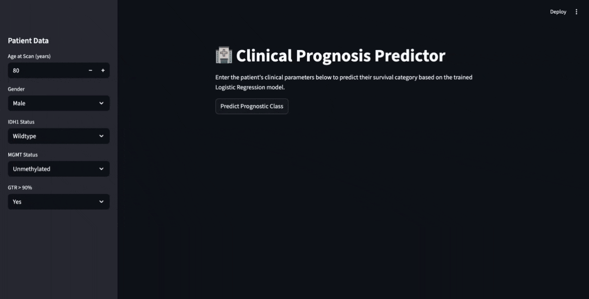
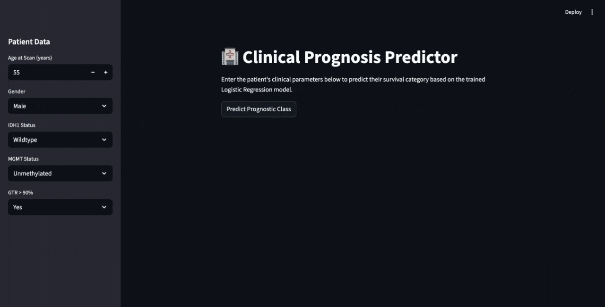

# Capstone_CJaramillo

This code package was written for submission as the Capstone Project for the Johns Hopkins course 
EN.585.771.81.SP26 by Couger Jaramillo.

## Developing Capstone_CJaramillo

1. Compiler: Python 3.12
2. IDE: PyCharm
3. Configured as module
4. Data obstained from The Cancer Imaging Archive: Bakas, S., Sako, C., Akbari, H., Bilello, M., Sotiras, A., Shukla, G., Rudie, 
J. D., Flores Santamaria, N., Fathi Kazerooni, A., Pati, S., Rathore, S., Mamourian, E., Ha, S. M., Parker, W., Doshi, J., 
Baid, U., Bergman, M., Binder, Z. A., Verma, R., … Davatzikos, C. (2021). Multi-parametric magnetic resonance imaging 
(mpMRI) scans for de novo Glioblastoma (GBM) patients from the University of Pennsylvania Health System (UPENN-GBM) 
(Version 2) [Data set]. The Cancer Imaging Archive. https://doi.org/10.7937/TCIA.709X-DN49


### Capstone_CJaramillo Usage:

```commandline
usage: terminal command 'streamlit run Capstone.py' will launch interactive webpage

Files for the Jupyter notebook Capstone.ipynb:

| input File        | Comment                                                                                                            |
|-------------------|--------------------------------------------------------------------------------------------------------------------|
| clinical_info.csv | Available for download at https://www.cancerimagingarchive.net/collection/upenn-gbm/                               |                                                   

 
```


## Packaging

### Project Layout

The following is a comprehensive description of the modules within this program. 

* [Capstone/](.): The "root" folder containing all following files.
    * [README.md](README.md):
      Description of package.
      * [Capstone.ipynb](cjimen21PA1):
        * This file is a Jupyter Notebook that imports (previously downloaded) data in the form of a csv file from the
        The Cancer Imaging Archive, performs some basic exploratory descriptive statistics, cleans it appropriately, 
        and uses it to train a logistic regression model for the prediction/stratification of brain cancer patients into 
        relative "good" and "poor prognostic categories". Finally the trained model is exported to the local directory
        as a .pkl for use in the accompanying python file.
      * [Capstone.py](cjimen21PA1):
        * This file is a python file that generates a steamlit app that applies the logistic regression model trained_model.pkl
        to user input data corresponding to the variables used to train the logistic regression model and present both the
        predicted prognostic group as well as the probabilities of class identity to contextualize that information a little. 
          Intentionally left blank.
      * [trained_model.pkl](proj0/__init__.py):
        * This stores the trained logistic regression model trained on the dataset clinical_info.csv
      * [clinical_info.csv](proj0/__init__.py):
        * This is the csv downloaded directly from The Cancer Imaging Archive with raw demographic, radiographic, surgical,
        and pathologic parameters used to train my logistic regression. 
      * [CapstoneProject.ppt](proj0/__init__.py): 
        * Slide deck with presentation to include audio notes and link to GIF demonstration.
      * 
      * 

### Known Bugs and Error Messages
This program is left in the exact state that I ran it to generate the streamlit app, please note that directory names for imoprting
data/exporting files will need to be changed if the user intends to run it themselves. 
